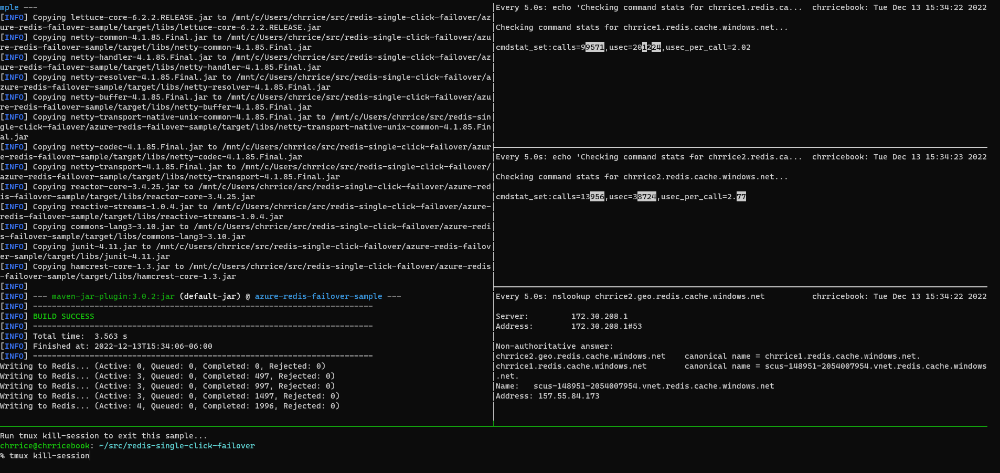
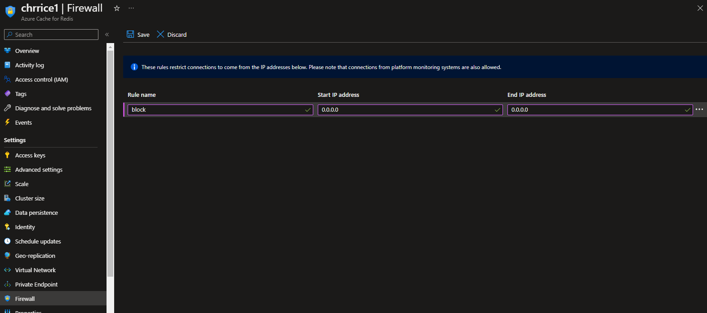
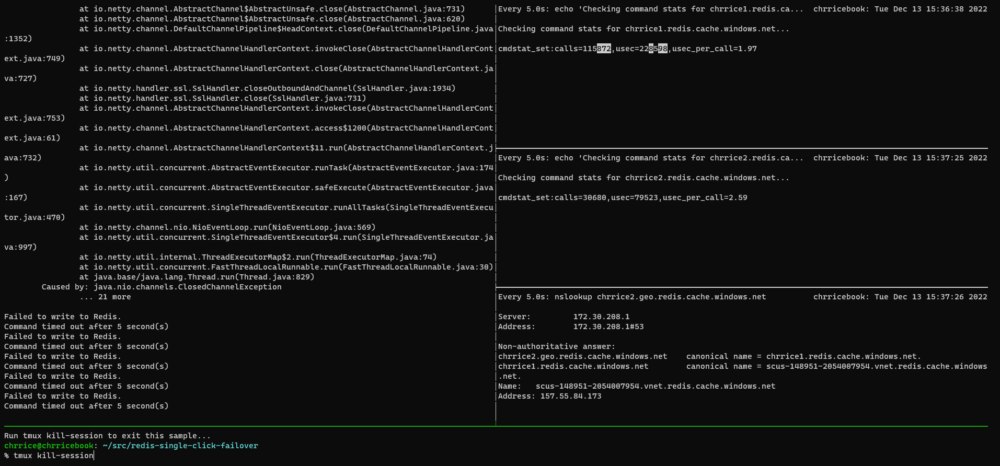
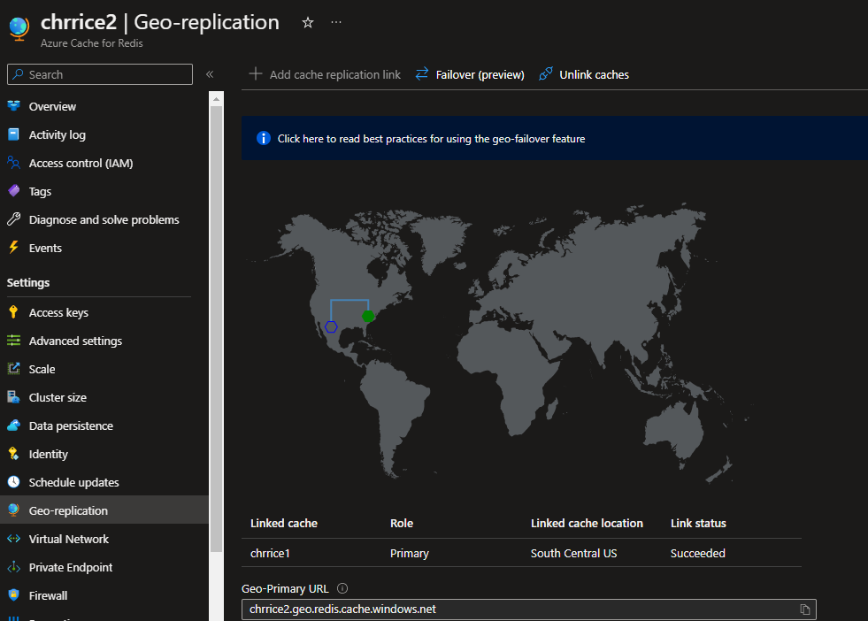
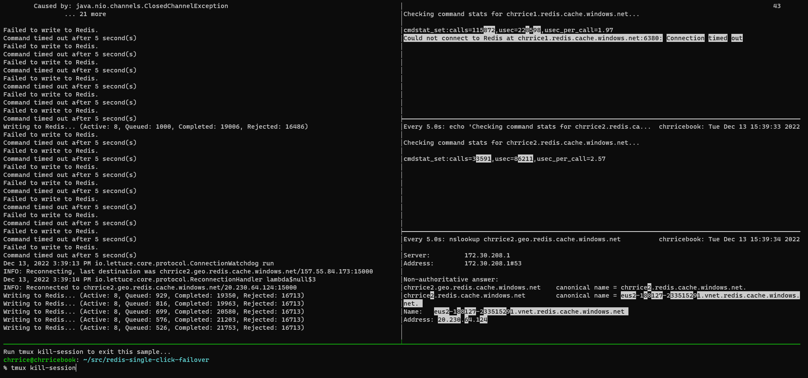

# Azure Redis Cache Seamless Failover Sample
This sample demonstrates the seamless geo-failover capabilities of [Azure Redis Cache passive geo-replication](https://learn.microsoft.com/en-us/azure/azure-cache-for-redis/cache-how-to-geo-replication) using the Lettuce client library.

## Prerequisites
- 2 Azure Redis Caches linked together for geo-replication
- A workstation with
  - Linux shell
  - Java 11
  - azure-cli installed and logged in
  - redis-cli
  - jq

## Running the Sample
To build and run the sample:

1. Navigate to the root directory of this project
2. Run `./run.sh 'cache_resource_id'` where `cache_resource_id` is the Azure resource ID of one of your caches (e.g. /subscriptions/abc123.../Microsoft.Cache/Redis/test)

This will lauch tmux showing multiple panes running the following (from top left, going clockwise):

1. The Java Redis client sample application
2. Current write stats for the Redis Cache you provided as an argument to `run.sh`
3. Current write stats for the Redis Cache that has a geo-replication link to the Redis Cache from 2
4. Current DNS resolution for the cache's geo-FQDN, which always points to the geo-primary cache
5. A pane pre-configured with the command to exit tmux (for those unfamiliar with it). This pane is highlighted by default, so simply pressing ENTER will exit the sample

## Simulating a Failure

1. While running the sample, navigate to the geo-primary cache in the Azure Portal
2. In the "Firewall" blade, add a firewall rule for the range 0.0.0.0-0.0.0.0. This will block traffic to the cache, simulating availability loss. 
3. Observe that:
    1. Pane 1 begins to show errors connecting to and executing commands against Redis and commands queuing up
    2. Panes 2 and 3 stop changing, demonstrating that write traffic has stopped

## Executing Failover

1. Once you've simulated the failure, navigate to the geo-secondary cache in the Azure Portal
2. In the "Geo-replication" blade, click on the "Failover" button and click "Yes" to confirm. 
3. As the failover process runs, switch back to the sample running in your shell
4. Observe that:
    1. After ~1 minute, Pane 4 will update, showing that DNS failover has completed
    2. A few moments after this, Pane 1 stops producing errors, quickly catches up on the queued operations, and resumes normal function
    3. One of Panes 2 and 3 will begin showing write activity

## Simulating Recovery

1. Now that the client application has recovered post-failover, navigate to the former geo-primary / new geo-seconary cache in the Azure Portal
2. In the "Firewall" blade, remove the firewall rule previously added
    1. Note that you may have to wait for the full geo-failover to complete before you can make this update
3. Observe that after a few seconds, both Panes 2 & 3 show write activity
    1. Note that the writes shown on the geo-secondary are from geo-replication activities
4. Navigate to the "Geo-replication" blade of one of your caches and click "Failover" to fail back to the original setup
5. In this scenario, you may need to force the client application to reconnect to the new primary once DNS failover is complete
    1. For the clustered scenario, this will happen automatically
    2. For the non-clustered scenario, you can either restart the client app or issue a `CLIENT KILL TYPE normal` command on the former geo-primary cache to force reconnection
